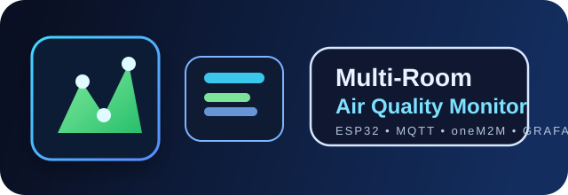
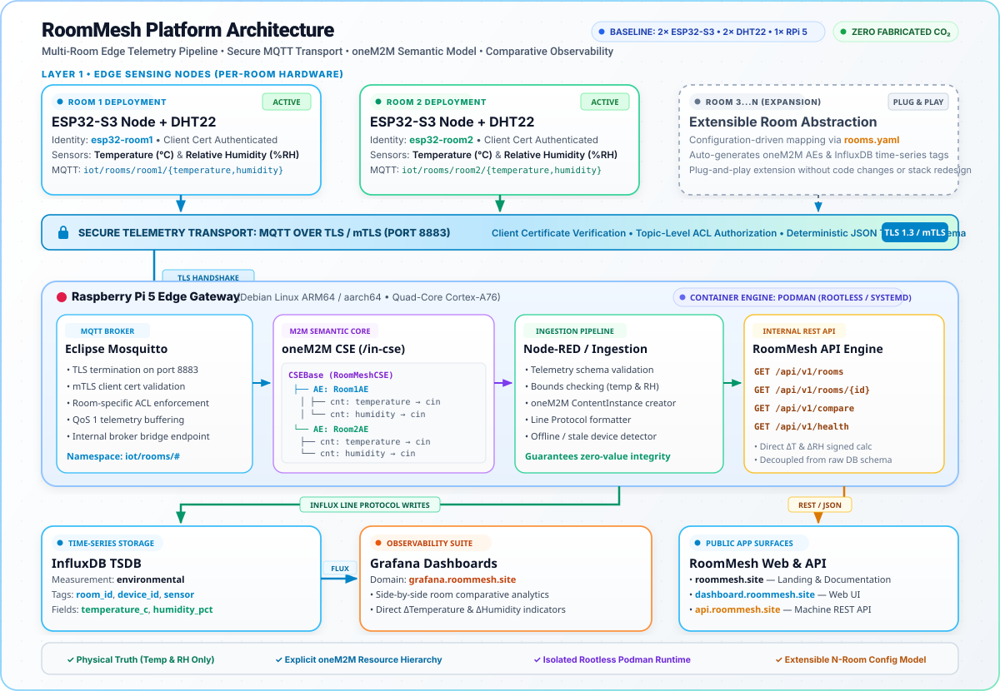

# RoomMesh - Multi-Room IoT Monitoring




RoomMesh is a multi-room environmental monitoring platform built around a Raspberry Pi 5 edge gateway, secure MQTT transport, oneM2M resource modelling, time-series persistence and room-to-room comparison dashboards. The project uses two ESP32-S3 sensor nodes and two DHT22 sensors as the initial deployment baseline while keeping the architecture extensible for additional rooms and future sensor types.

This repository serves as the project engineering blueprint for a reproducible IoT platform that reflects the real constraints of the current deployment: the system measures temperature and humidity only and does not fabricate CO₂ values.

## Project identity

- GitHub repository: multi-room-iot-monitoring
- Public project identity: RoomMesh
- Primary domain: roommesh.site
- Dashboard domain: dashboard.roommesh.site
- API domain: api.roommesh.site
- Grafana domain: grafana.roommesh.site

## Mission

RoomMesh brings together room-level sensing, secure transport, edge processing and visual comparison into a single monitoring platform. The design supports direct comparison between rooms, while remaining suitable for future extension to additional rooms and sensor capabilities.

## Hardware reality

Current physical hardware:

- 2 × ESP32-S3
- 2 × DHT22
- 1 × Raspberry Pi 5

This means the current deployment is a two-room environmental monitoring system with:

- temperature
- relative humidity

The project currently does not include CO₂ values. CO₂ support may be designed as a future extension, but it remains clearly labelled as optional and unavailable until we are able to secure a real sensor and validate its readings.

## System architecture



### Logical data path

The platform follows a simple room-to-dashboard progression:

Room → ESP32-S3 identity → MQTT topic → MQTT message → oneM2M AE → oneM2M container → content instance → InfluxDB → API → Grafana dashboard

## Room model

The canonical room abstraction is configuration-driven and should support room1, room2, room3 and beyond without redesigning the stack.

```yaml
rooms:
  room1:
    device_id: esp32-room1
    mqtt_client_id: esp32-room1
    oneM2M_ae: Room1AE

  room2:
    device_id: esp32-room2
    mqtt_client_id: esp32-room2
    oneM2M_ae: Room2AE
```

This model keeps room identity deterministic and avoids hard-coding room logic across services.

## MQTT architecture

Mosquitto serves as the broker, and MQTT remains the primary telemetry transport path for the system.

A room-aware topic structure keeps data deterministic and easy to validate:

- iot/rooms/room1/temperature
- iot/rooms/room1/humidity
- iot/rooms/room2/temperature
- iot/rooms/room2/humidity

A typical telemetry payload contains the room and device identity together with the measured values:

```json
{
  "room_id": "room1",
  "device_id": "esp32-room1",
  "sensor": "dht22",
  "temperature_c": 23.4,
  "humidity_pct": 48.2,
  "timestamp": "2026-09-17T08:00:00Z"
}
```

The final deployment preserves the established payload contract where one already exists, while maintaining a clear and consistent message format.

## MQTT security and certificate model

The system preserves secure broker operation and does not fall back to anonymous or unauthenticated MQTT.

The platform follows these security properties:

- TLS enabled
- mTLS client validation where used
- certificate identity checks
- MQTT authentication and authorisation
- ACL enforcement for room-specific topics
- no private keys or production secrets committed to the repository

The certificate model aligns service identity with the broker and authentication policy. Certificate identities match the intended MQTT identity and ACL rules; a valid TLS handshake alone is not sufficient evidence of proper broker authorisation.

## oneM2M architecture

The oneM2M layer represents a true room-based hierarchy rather than a generic flat container model.

Each room is represented by its own application entity, with sensor-specific containers beneath it:

- Room1AE
  - temperature
  - humidity
- Room2AE
  - temperature
  - humidity

The mapping between the room, ESP32 identity, MQTT topic, oneM2M application entity and content instance should be explicit and auditable, without creating duplicate resources for the same measurement.

## MQTT → oneM2M integration

The integration layer performs the following steps:

1. subscribe to authorised room telemetry topics
2. validate incoming messages
3. identify the room and device
4. identify the sensor type
5. validate measurement values and timestamps
6. map to the target AE and container
7. create the content instance
8. record success or failure
9. expose health and diagnostic information

If Node-RED is used, it remains a clearly documented integration layer and does not duplicate the main business logic.

## Podman and Raspberry Pi 5 architecture

The project runs on Raspberry Pi 5 with Podman as the container runtime and remains compatible with ARM64 / aarch64.

The relevant service layout is expected to include:

- Mosquitto
- oneM2M CSE
- integration / API service
- Node-RED
- InfluxDB
- Grafana

The repository preserves an existing Podman architecture and improves it rather than replacing a functioning setup with a competing deployment model.

## Data model and storage

InfluxDB stores paired historical environmental readings in a format that supports room comparison.

Recommended schema:

```text
measurement: environmental

tags:
  room_id
  device_id
  sensor

fields:
  temperature_c
  humidity_pct
```

This keeps the data model direct and efficient for dashboards while avoiding unnecessary duplication across multiple measurements.

## Grafana and dashboard design

Grafana provides the multi-room comparison view for a building-level environment dashboard.

Required views:

- current room status
- temperature comparison between room1 and room2
- humidity comparison between room1 and room2
- historical time-range comparison
- difference metrics such as ΔTemperature and ΔHumidity
- stale/offline/unknown device indicators

The dashboard does not hide the sign of a calculated difference, and it does not present a fabricated CO₂ panel without real sensor validation.

## RoomMesh web and API architecture

The project separates the primary interfaces as follows:

- roommesh.site for the project landing page and documentation
- dashboard.roommesh.site for the human-facing RoomMesh dashboard
- api.roommesh.site for the machine-facing API
- grafana.roommesh.site for Grafana-based observability and analysis

The API layer exposes the room and comparison data in a structured way without exposing raw storage details directly. A minimal and coherent set of endpoints supports rooms, current state, history and health checks.

## Data quality and device availability

The implementation validates and classifies telemetry in a way that distinguishes:

- current observation
- historical observation
- device online/offline
- stale data
- missing data
- invalid data
- system error

A missing reading does not silently become a zero value. Device availability remains explicit and observable.

## ESP32-S3 firmware requirements

Each ESP32-S3 node is configured with:

- room_id
- device_id
- MQTT client identity
- MQTT broker address and port
- TLS certificate configuration
- publish interval

The firmware handles:

- failed sensor reads
- invalid temperatures or humidity values
- Wi-Fi loss
- TLS failures
- MQTT disconnection and reconnect
- timing problems and stale-data handling

Production credentials are not hard-coded into the firmware source files.

## Configuration and secrets

The repository maintains a clear separation between:

- source code
- configuration
- secrets
- runtime state
- persistent storage

An example configuration file such as `.env.example` provides placeholders rather than real values. Private keys, certificates, passwords and tokens are not committed to Git.

## Installation and deployment workflow

The deployment process follows a clear sequence:

1. clone the repository
2. configure environment variables and room definitions
3. provision certificates and secrets
4. prepare persistent storage
5. start the Podman services
6. verify service health
7. verify MQTT telemetry
8. verify oneM2M ingestion
9. verify InfluxDB persistence
10. verify Grafana dashboard data

This workflow remains reproducible for a technically competent user without undocumented steps.

## Certificate provisioning and infrastructure

The project already includes or expects certificate management for relevant services. The implementation preserves these patterns rather than introducing a parallel PKI workflow.

Relevant certificate identities may include:

- mosquitto
- client
- ble
- influxdb
- backend

Private certificates and keys remain outside source control.

## Testing strategy

The project includes validation at multiple levels:

### Unit tests
- payload parsing
- room mapping
- sensor mapping
- oneM2M mapping
- API transformation
- validation logic

### Integration tests
- ESP32 → MQTT → integration → oneM2M → InfluxDB → API
- room1 and room2 independent validation
- simultaneous multi-room comparison verification

### Failure testing
- MQTT broker unavailable
- invalid payloads
- invalid DHT22 values
- oneM2M unavailable
- InfluxDB unavailable
- stale readings
- unauthorised MQTT client
- expired TLS certificate
- unknown room identifier

The system must fail observably, not silently.

## Troubleshooting

Common operational checks include:

- verifying MQTT broker availability and TLS validity
- confirming MQTT ACL and client identity behaviour
- checking room-to-topic mapping
- verifying oneM2M AE/container creation
- confirming data appears in InfluxDB with the correct tags and fields
- validating Grafana datasource connectivity
- checking the API for stale or missing data
- confirming room online/offline status logic

## Extension to additional rooms

The architecture is intentionally extensible beyond the initial two-room deployment. Additional rooms can be introduced through configuration and mapping definitions rather than duplicating source logic across the stack.

## Extension to additional sensors

The project architecture allows future sensor types, but only if they are backed by real hardware and verified data paths. CO₂ is explicitly a future extension, not a current claim of measurement capability.

Selected sensor extension pattern:

- define the schema
- map the sensor to room and MQTT topic
- extend oneM2M container hierarchy
- add database fields or tags as needed
- expose the new value in the API and dashboards

## Project limitations

This project currently has real-world constraints that must be documented honestly:

- the available sensor suite is DHT22-based and provides temperature and humidity only
- no confirmed CO₂ sensor is currently available
- fabricated CO₂ data is not acceptable in a production path
- dashboards and APIs must distinguish known, unknown, stale and missing values
- production security requires validated TLS and identity controls

## Authors

MIO3B: Advanced IoT Systems Development

- Janwalkar Pooja
- Moçi AnnaMaria
- Mosudi Isiaka
- Philip Julia

## License

This project is distributed under the BSD 3-Clause License. See [LICENSE](LICENSE) for the complete terms and conditions.

## Notes

This repository is intended as the engineering blueprint for a complete multi-room IoT monitoring system, with secure edge deployment, room-aware resource modelling and comparative analytics across environmental conditions.
